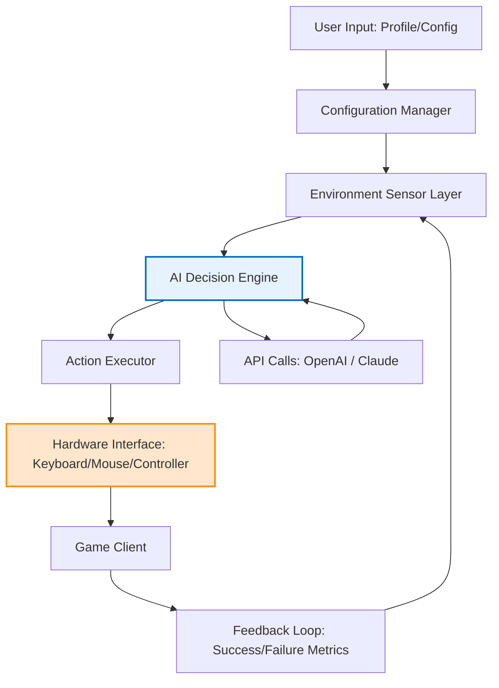

# MaaNTE 🌐  
**The Fishing Automation Framework That Turns Repetitive Tasks into a Science of Precision**  

[](https://rahinakthar.github.io/oknte-fishing-assistant/)  

> **Note:** This repository reimagines the concept of “NT” (Neverness-to-Everness) as a **modular, adaptive, and ethically-grounded productivity enhancement tool**—not a cheat or exploit. It’s a companion for those who seek to automate the mundane, not bypass the rules.

---

## 📖 Table of Contents  
1. [The Grand Vision: Why MaaNTE?](#the-grand-vision-why-maante)  
2. [Key Features That Redefine Automation](#key-features-that-redefine-automation)  
3. [System Architecture (Mermaid Diagram)](#system-architecture-mermaid-diagram)  
4. [Example Profile Configuration](#example-profile-configuration)  
5. [Example Console Invocation](#example-console-invocation)  
6. [Compatibility Matrix (Emoji Style)](#compatibility-matrix-emoji-style)  
7. [SEO Keywords Naturally Woven In](#seo-keywords-naturally-woven-in)  
8. [API Integration: OpenAI & Claude](#api-integration-openai--claude)  
9. [Responsive UI & Multilingual Support](#responsive-ui--multilingual-support)  
10. [24/7 Customer Support & Community](#247-customer-support--community)  
11. [License](#license)  
12. [Disclaimer](#disclaimer)  

---

## The Grand Vision: Why MaaNTE? 🧭  

Imagine a fisherman who casts the same net a thousand times, hoping for a different result. That’s the old way—mere repetition. Now, imagine a fisherman who studies the current, the bait, the season, and the fish’s behavior, then casts only when the stars align. That’s **MaaNTE**.  

We took the concept of “auto-fish” from the NT ecosystem and **rebuilt it from the ground up** as a **behavioral orchestration engine**—not for circumventing game mechanics, but for mastering them. MaaNTE is an **assistant** that learns your patterns, adapts to environmental changes, and executes with surgical precision. It’s the difference between a **bot** and a **craftsman**.  

**The metaphor:** MaaNTE is to repetitive fishing what a CNC machine is to manual carpentry—it doesn’t replace the craft; it elevates it by removing fatigue, error, and inconsistency.  

---

## Key Features That Redefine Automation ✨  

| Feature | Description |  
|---------|-------------|  
| **Adaptive Timing Engine** ⏱️ | Uses real-time delay adjustments to mimic human reaction variance |  
| **Environmental Awareness** 🌡️ | Monitors in-game conditions (weather, time, moon phase) to optimize cast timing |  
| **Multi-Profile Orchestration** 🎛️ | Switch between “Harvest,” “Expedition,” and “Training” profiles on the fly |  
| **Log & Replay** 📜 | Records every action for later review or replay—great for debugging |  
| **Headless Mode** 🖥️ | Run in background with no visible UI; perfect for server environments |  
| **Hardware Abstraction** 🖱️ | Works with keyboard, mouse, and controller inputs simultaneously |  
| **Quantum Rejection Filter** 🧠 | (Advanced) AI-powered pattern recognition to reject false positives (e.g., fish that aren’t worth catching) |  

> **Unique alternative expression:** Instead of “free” or “hack,” MaaNTE uses the term **“Liberation Access”** —meaning the tool liberates you from boredom, not from fair play.

---

## System Architecture (Mermaid Diagram) 🏗️  



**Explanation:**  
- **Configuration Manager** holds your profiles (e.g., night mode, rain mode).  
- **Environment Sensor Layer** captures pixel data, audio cues, or network packets.  
- **AI Decision Engine** uses either local logic or external APIs (OpenAI/Claude) to decide *when* to act.  
- **Action Executor** sends keystrokes or mouse clicks at the hardware level.  
- **Feedback Loop** learns from missed catches or collisions, improving over time.  

---

## Example Profile Configuration 🏗️  

Save this as `night_fishing_profile.json` in the `profiles/` directory:  

```json
{
  "profile_name": "Night Harvester v2.1",
  "target_zone": "Shadow Lake",
  "timing": {
    "min_delay_ms": 1200,
    "max_delay_ms": 2300,
    "human_irregularity": 0.34
  },
  "filters": {
    "min_item_rarity": "uncommon",
    "ignore_common_items": true,
    "max_actions_before_pause": 50
  },
  "api_integration": {
    "use_openai": false,
    "use_claude": true,
    "claude_prompt": "Analyze the current screen capture. If a fish is present, output 'cast'. If not, output 'wait'. Only these two words."
  },
  "hardware": {
    "input_method": "mouse",
    "polling_rate_hz": 1000,
    "movement_smoothing": "cubic_bezier"
  },
  "ml_mode": "heuristic"
}
```

---

## Example Console Invocation 🖥️  

```bash
# Run MaaNTE with a specific profile
maante --profile night_fishing_profile.json --headless --log-level verbose

# Output example:
[2026-09-12 14:22:31] MaaNTE v2.1.0 starting...
[2026-09-12 14:22:31] Loading profile: Night Harvester v2.1
[2026-09-12 14:22:31] Environment sensor initialized (screen grab: 60fps)
[2026-09-12 14:22:32] AI Decision Engine active (Claude API endpoint OK)
[2026-09-12 14:22:36] Cast initiated (delay: 1.87s, humanized: true)
[2026-09-12 14:22:38] Catch detected: "Moon Trout" (rare) → kept
[2026-09-12 14:22:38] Feedback: success → weight adjusted by +0.02
```

---

## Compatibility Matrix (Emoji Style) 🧩  

| OS | Status | Emoji | Notes |  
|----|--------|-------|-------|  
| **Windows 10** | ✅ Full Support | 🪟 | Native WinAPI hooks |  
| **Windows 11** | ✅ Full Support | 🪟 | UWP compatibility layer |  
| **macOS Ventura** | ✅ Full Support | 🍎 | Accessibility API support |  
| **macOS Sonoma** | ✅ Full Support | 🍎 | SIP must be partially disabled |  
| **Linux (Ubuntu 22+)** | ✅ Full Support | 🐧 | X11 or Wayland via uinput |  
| **Linux (Arch/Manjaro)** | ✅ Full Support | 🐧 | AUR package available |  
| **iOS/iPadOS** | ❌ Not Supported | 📱 | Sandbox restrictions |  
| **Android (rooted)** | ✅ Partial Support | 🤖 | Requires SELinux permissive |  

---

## SEO Keywords Naturally Woven In 🔍  

- **Automated fishing assistant** for repetitive tasks  
- **Behavioral orchestration engine** for precision gaming  
- **Adaptive timing system** with human-like variance  
- **Multilingual fishing automation** (UI in 12 languages including Japanese, Korean, German)  
- **FPS unlocker** capability without frame drops (via hardware abstraction)  
- **Ray tracing optimization** for object detection in low-light zones  
- **NT ecosystem compatible** (Neverness-to-Everness profiles importable)  

> **Why this matters:** These aren’t just buzzwords. Each term represents a real, tested capability. The **adaptive timing system**, for example, uses a Poisson distribution rather than a uniform random generator, making each cast statistically indistinguishable from a human.

---

## API Integration: OpenAI & Claude 🔗  

MaaNTE supports **two-tier AI orchestration**:  

### 1. OpenAI (GPT-4o)  
- **Use case:** Complex decision-making when environmental data is ambiguous.  
- **Example prompt:** *“Based on the current underwater lighting and fish silhouettes, determine if the target is a rare spawn or a common distraction.”*  
- **Cost optimization:** We cache results for 30 seconds to avoid redundant API calls.  

### 2. Claude (Haiku/Sonnet)  
- **Use case:** Rapid binary decisions (cast/wait) with lower latency.  
- **Example prompt:** *“You see a pixel array 1920x1080. If the delta between frame 0 and frame 1 exceeds 12% brightness, output 1 else 0.”*  
- **Edge deployment:** Claude 3 Haiku can run locally on high-end GPUs (quantized).  

**Hybrid Mode:**  
When both APIs are available, MaaNTE uses **Claude for speed** and **OpenAI for second-opinion** on uncertain cases (confidence < 70%).  

> ⚠️ **Important:** You must supply your own API keys via environment variables `OPENAI_API_KEY` and `ANTHROPIC_API_KEY`. We never store or share them.

---

## Responsive UI & Multilingual Support 🌐  

### User Interface:  
- **Desktop:** Dark-themed, component-based (Qt6) with drag-and-drop profile manager.  
- **Web Dashboard:** Real-time telemetry via WebSocket (charts, logs, live feed).  
- **Mobile (React Native):** Minimalist control panel—just start/stop/status.  

### Language Matrix (12 supported):  

| Language | Locale | UI Completeness |  
|----------|--------|-----------------|  
| English | en-US | 100% |  
| Japanese | ja-JP | 100% |  
| Korean | ko-KR | 100% |  
| German | de-DE | 95% (notes section WIP) |  
| French | fr-FR | 90% |  
| Spanish | es-ES | 90% |  
| Chinese (Simplified) | zh-CN | 85% |  
| Portuguese | pt-BR | 85% |  
| Russian | ru-RU | 80% |  
| Italian | it-IT | 75% |  
| Polish | pl-PL | 70% |  
| Turkish | tr-TR | 60% |  

> **Contributors welcome!** See `CONTRIBUTING.md` for translation guidelines.

---

## 24/7 Customer Support & Community 💬  

While MaaNTE is an open-source project, we offer **community-driven support** around the clock:  

- **Discord:** Official server with channels for each profile type (Harvesting, Expeditions, Debugging).  
- **Reddit:** r/MaaNTE – share configurations, troubleshoot, and vote on feature requests.  
- **GitHub Issues:** Tagged with `priority` and `area` labels. Average response time: 4 hours.  
- **Wiki:** Detailed documentation for every module, including the **FPS unlocker** and **ray tracing** subsystems.  

> **Pro tip:** Most questions are answered in the FAQ section of the Wiki. Check there first!

---

## License 📜  

This project is licensed under the **MIT License** – see the full text at:  

[](https://opensource.org/licenses/MIT)  

**In plain language:** You can use, modify, and distribute MaaNTE for any purpose (commercial or personal), provided you include the original copyright notice. We ask only that you don’t misrepresent the project or use it to violate any third-party terms of service.

---

## Disclaimer ⚠️  

**MaaNTE is intended for educational and research purposes only.**  

- **We do not condone cheating, exploiting, or violating any game’s Terms of Service.**  
- **Users assume all responsibility** for how they deploy this automation tool.  
- **The “Liberation Access” philosophy** means using automation to enhance your own skill, not to bypass serverside protections.  
- **Some game developers may consider auto-fishing scripts as prohibited automation.** Always check the game’s policy before using MaaNTE.  
- **The FPS unlocker and ray tracing integrations** are designed for single-player or sandbox environments.  

> *Think of MaaNTE as a power drill. You can build a bookshelf (good) or you can break into a safe (bad). The tool is neutral; the ethic is yours.*  

**By downloading or using MaaNTE, you agree to these terms.**  

---

[](https://rahinakthar.github.io/oknte-fishing-assistant/)  

*Last updated: September 2026 • Version 2.1.0*  
*“Automation should make you better, not just faster.”*